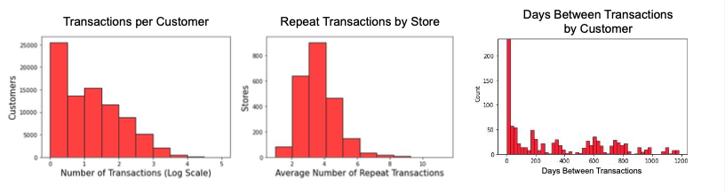
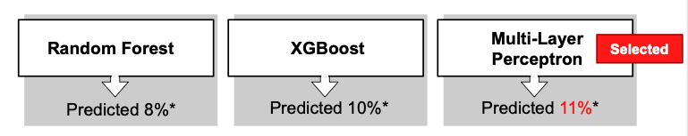

# Repeat Customer Prediction

- With more substantial feature engineering and a model selection, our project group out-performed all teams in the current and previous class year.
- We compared tree-based and neural network approaches, finding our best results in a multilayer perceptron model with three fully-connected hidden layers (10/30/10), ReLU activation functions, and an Adam optimizer.
- This is a personal fork of an academic group project. Credit to Mubarak Ganiyu, Sydney Simmons, Shuyang Lin, and Weixi Chen for initial work.

# Objective

- Create a model to predict likely Bridgestone customers in the next month
- The motivation behind the model is to enable targetted marketing for increased ROI

## Data security
The dataset is for research purpose only and not shared in the public repo.

## Data Description

- Individual customer IDs
- Vehicle characteristics
- Retail store information
- Product details
- Sales transactions

**Note:**
- Discounts appear as separate line items (usually with negative sales amount) within transactions.
- Transaction IDs are only unique within store-day.
- Product group = 5 to filter on tires. 

# Project Notebook Structure
All *0- (e.g., 10-, 20-, 30-) files contain finalized work for the purpose described (e.g., “process-data”). Subfiles related to the task are *#- (e.g., 11-, 12-)
